# GBO Reference Architecture

## Executive Summary

GBO (Gemeenschappelijke Bronontsluiting) provides a common source access layer enabling government data sources -- Belastingdienst, RvIG, DUO, UWV, gemeenten -- to serve five consuming trajectories through a single technical backbone:

1. **DvTP** (Delen via Toestemming met Private partijen): Consent-based data sharing from government to private sector _(fully in draft -- no documents finalized)_
2. **EDI-wallet** (European Digital Identity): Citizen-held attestations from government sources, issued by a shared PubEAA Provider
3. **SDG-OOTS** (Single Digital Gateway): Cross-border evidence exchange within the EU
4. **Gov-to-Gov**: Direct government-to-government data exchange over FSC + GraphQL, authorized by legal basis
5. **Authentic Source Interface** (ETSI TS 119 478): Mandated by Article 45e eIDAS -- enables QTSPs to verify attributes against government registers so they can issue QEAAs

The architecture rests on seven pillars:

| Pillar                    | Standard                                                                                                                                                                                                                              | Proven by                                   |
| ------------------------- | ------------------------------------------------------------------------------------------------------------------------------------------------------------------------------------------------------------------------------------- | ------------------------------------------- |
| **Data access**           | GraphQL with scope-driven field authorization (dienstencatalogus) + constraint-based where-clause binding, validated via `graphql.parse_query()` AST inspection                                                                       | iWlz / nID (healthcare, production)         |
| **Authorization**         | Five-factor authorization model → federated PDP (OPA/Rego) via AuthZEN, no central authorization server. FSC Manager issues cert-bound JWTs. PAP (Policy Administration Point) distributes signed bundles via OCI registry.           | iWlz + FTV + FSC                            |
| **Connectivity**          | FSC (domestic REST) + AS4 bridge (cross-border, EU mandate)                                                                                                                                                                           | FSC (government), Domibus (EU)              |
| **Consent / Legal basis** | Toestemmingsregister as PIP for consent-based access; legal basis encoded in policy bundles for law-mandated access. Two paths, same PDP. Single consent spans multiple bronhouders; wettelijke dienstencatalogus caps maximum scope. | New -- replaces DvTP's custom authorization |
| **Pseudonymization**      | BSNk PP polymorphic pseudonyms for BSN-free private sector queries                                                                                                                                                                    | BSNk PP (Logius, production)                |
| **EUDI issuance**         | PubEAA Provider (shared, optional per bronhouder) + OpenID4VCI                                                                                                                                                                        | New -- avoids 100% QTSP reliance            |
| **EUDI verification**     | Authentic Source Interface (ETSI TS 119 478, I2 Verify + I4 Authorize)                                                                                                                                                                | New -- Article 45e mandate                  |

---

## Architecture Overview

```mermaid

graph TB
    subgraph Consumers
        direction TB
        HV["Private Dienstverlener<br/>(e.g. hypotheekverlener)]
        WALLET[EUDI Wallet]
        EU_PROC[EU Online Procedure]
        GOV["Afnemer (overheid)"]
        QTSP[QTSP]
    end

    subgraph "GBO Shared Services"
        direction LR
        PORTAL[Toestemmingsportaal]
        CREG[(Toestemmingsregister / PIP)]
        BSNK[BSNk PP - Pseudonymization]
        SECTOR_PIP["Sector PIPs<br/>(KNB, KvK, BIG)"]
        ASIP[Authentic Source Interface]
        PUBEAA[PubEAA Provider]
        AS4_BRIDGE[SDG-OOTS Adapter]
        DOMIBUS[Domibus Access Point]
    end

    subgraph "Central — Policy Distribution"
        OCI["PAP — OCI Registry<br/>(signed OPA bundles)"]
    end

    subgraph "Bronhouder (e.g. Belastingdienst)"
        direction TB
        MGR["FSC Manager<br/>(Manager PDP ①②)"]
        FSC_IN[FSC Inway]
        PEP[PEP]
        PDP["Bronhouder PDP ③④⑤<br/>OPA/Rego"]
        GQL[GraphQL API]
    end

    %% Policy distribution — same PAP feeds both PDPs
    OCI -->|"OPA Bundle API"| MGR
    OCI -->|"OPA Bundle API"| PDP

    %% DvTP flow
    HV -->|"FSC Outway<br/>mTLS + PKI-O"| MGR
    MGR -->|"JWT with<br/>verified claims"| FSC_IN
    FSC_IN --> PEP
    PEP -->|"AuthZEN eval"| PDP
    PDP -.->|"consent check<br/>(DvTP only)"| CREG
    PEP -->|"if allowed"| GQL

    %% Manager PIP
    SECTOR_PIP -.->|"org attributes"| MGR

    %% Consent flow
    HV -.->|"redirect citizen"| PORTAL
    PORTAL -->|"write consent"| CREG
    PORTAL -->|"activate/transform"| BSNK
    BSNK -.->|"EP in consent token"| HV
    PEP -->|"resolve PI to BSN"| BSNK

    %% Gov-to-Gov flow
    GOV -->|"FSC"| MGR

    %% EUDI issuance flow (PubEAA Provider)
    WALLET -->|"OpenID4VCI"| PUBEAA
    PUBEAA -->|"FSC"| FSC_IN

    %% Authentic Source Interface flow
    QTSP -->|"I2 Verify"| ASIP
    ASIP -->|"FSC"| FSC_IN

    %% OOTS flow
    EU_PROC -->|"AS4"| DOMIBUS
    DOMIBUS --> AS4_BRIDGE
    AS4_BRIDGE -->|"REST/FSC"| MGR

    style CREG fill:#5b2d6b,stroke:#333,color:#fff
    style PDP fill:#5b2d6b,stroke:#333,color:#fff
    style PEP fill:#5b2d6b,stroke:#333,color:#fff
    style MGR fill:#5b2d6b,stroke:#333,color:#fff
    style SECTOR_PIP fill:#5b2d6b,stroke:#333,color:#fff
    style AS4_BRIDGE fill:#2d7a2d,stroke:#333,color:#fff
    style BSNK fill:#6b3a6b,stroke:#333,color:#fff
    style GQL fill:#2d7a2d,stroke:#333,color:#fff
    style PUBEAA fill:#1a5276,stroke:#333,color:#fff
    style ASIP fill:#1a5276,stroke:#333,color:#fff
    style HV fill:#1a3c4d,stroke:#333,color:#fff
    style WALLET fill:#1a3c4d,stroke:#333,color:#fff
    style EU_PROC fill:#1a3c4d,stroke:#333,color:#fff
    style GOV fill:#1a3c4d,stroke:#333,color:#fff
    style QTSP fill:#1a3c4d,stroke:#333,color:#fff
```

The architecture separates concerns cleanly:

- **Bronhouders** expose a single GraphQL API behind an FSC Inway with PBAC enforcement. They do not implement trajectory-specific protocols. Each bronhouder runs a federated PDP (OPA/Rego) loaded with centrally-authored, signed policy bundles.
- **The GBO edge layer** handles protocol translation: consent portal + BSNk PP for DvTP, Domibus/AS4 bridge for OOTS (EU mandate), PubEAA Provider for EUDI wallet issuance, Authentic Source Interface for QTSP attribute verification (Article 45e).
- **Authorization is federated**: every data request passes through the same PEP/PDP chain at the bronhouder. The FSC Manager (provider-side) issues cert-bound JWTs — there is no central authorization server. The toestemmingsregister (PIP) is the only centralized runtime dependency, and only for consent-based flows. Legal basis flows evaluate entirely locally.
- **PAP (Policy Administration Point) is a central policy service with async distribution**: policies authored by GBO Gremium, signed, distributed as OPA bundles via OCI registry (the PAP), pulled independently by each bronhouder's PDP at regular intervals.
- **Gov-to-Gov** is the simplest path: direct FSC Outway → Manager → Inway with legal-basis authorization, no consent or pseudonymization needed.
- **The PubEAA Provider** is shared infrastructure -- bronhouders can optionally run their own Credential Issuer, but the default path avoids 100% reliance on commercial QTSPs for government-sourced attestations.

---

## Core Design Decisions

### 1. GraphQL over REST for Bronontsluiting APIs

**Decision**: Bronhouders expose GraphQL endpoints, not REST APIs.

**Why**: REST requires additional patterns to achieve field-level data minimization. Data minimization in DvTP means you need different field sets per consent scope. With REST, that means separate endpoints per scope or custom filter parameters -- and then policies to control which filters each consumer may use. Over time, this can lead to duplicated logic between the API layer and the policy layer.

With GraphQL, data minimization is the default. Each consumer sends a query selecting exactly the fields they need. The policy engine controls which parts of the schema each consumer can access. The query IS the data minimization.

**Precedent**: iWlz runs GraphQL + OPA/Rego in production for sensitive healthcare data (WLZ Indicatieregister). The pattern is proven at scale with Dutch government data.

**FDS compatibility**: FDS does not prohibit GraphQL. The IMX orchestration engine already supports GraphQL as a backend. Lock-Unlock explicitly identifies the problem with REST for fine-grained access. GraphQL runs over HTTP -- FSC Inway/Outway proxies it without modification.

### 2. Access Basis: Consent Register (PIP) or Legal Basis (Policy Bundle)

**Decision**: Authorization concern ③ (access basis) has two paths. For consent-based access (DvTP): when a citizen gives consent via the portal, it is written to a register that serves as a PIP for the PBAC authorization chain. For legal basis access (wettelijke grondslag): the legal basis is encoded in the signed policy bundle and evaluated locally — no PIP call needed, no citizen involvement. Both paths use the same PDP; the Rego policy branches on whether a `legal_basis` or `consent_id` claim is present.

**What this replaces** (from DvTP draft v0.1 -- note: all DvTP documents are in draft status, nothing has been finalized):

| DvTP draft v0.1 component               | Replaced by                      | Why                                 |
| --------------------------------------- | -------------------------------- | ----------------------------------- |
| Autorisatievoorziening (custom gateway) | PEP + PDP (FTV/AuthZEN standard) | Reusable across all trajectories    |
| Vertrouwensleverancier + trust token    | FSC Contract + mTLS              | FSC already handles org-level trust |
| Double consent check at bronhouder      | Single PDP evaluation at PEP     | Policy decision is authoritative    |
| Consentregister (standalone database)   | Same register, exposed as PIP    | Same data, standard interface       |

The citizen experience is identical. The change is plumbing: what happens after consent is recorded, and how the data request is authorized.

### 3. Consent Model: Multi-Source Scoping, Dienstencatalogus, and Integrator Onboarding

**Decision**: Toestemmingen (consents) are not 1:1 linked to a single bronhouder or data source. A single toestemmingsaanvraag can span multiple bronhouders and data elements simultaneously. A wettelijke dienstencatalogus defines the maximum reikwijdte (scope) of what may be requested. Integrators (softwarepartijen) that technically execute API calls must be separately onboarded.

**Multi-source consent**: A citizen giving consent for a mortgage application does not give five separate consents to five separate bronhouders. Instead, the toestemmingsportaal presents a single consent screen covering all required data elements across sources. One consent action, multiple bronhouders:

| Bronhouder      | Data element       | Voorbeeld scope-ID |
| --------------- | ------------------ | ------------------ |
| Belastingdienst | IB vorig jaar      | `bd:ib:2025`       |
| Belastingdienst | IB jaar daarvoor   | `bd:ib:2024`       |
| DUO             | Studieschuld       | `duo:studieschuld` |
| UWV             | Inkomen            | `uwv:inkomen`      |
| BKR             | Kredietregistratie | `bkr:registratie`  |

The toestemmingsregister stores this as a single consent record with multiple scope entries. Each scope entry references a bronhouder + data element + time period. When a dienstverlener later queries a specific bronhouder, the PDP checks whether the consent record includes a matching scope entry for that bronhouder -- not whether a separate consent exists.

**Wettelijke dienstencatalogus as ceiling**: The dienstencatalogus is a legally anchored register (grondslag in AMvB / ministeriële regeling) that defines the maximum reikwijdte of data that may be requested per use case. It acts as a policy ceiling:

- The consent screen can only show data elements that appear in the dienstencatalogus for the relevant use case
- The PDP enforces the catalog as a hard constraint -- even if a consent record somehow includes a scope outside the catalog, the policy denies it
- The catalog is maintained by Bureau DvTP and updated through a formal governance process (sectorvertegenwoordiger → Bureau DvTP → departementale toetsing)

This separation means: the dienstencatalogus defines what is _maximally possible_, the citizen's consent defines what is _actually permitted_ for a specific request.

**Two-axis enforcement — scopes + constraints**: GraphQL authorization in GBO combines two complementary mechanisms, following the pattern proven by nID/iWlz in production:

- **Scopes** (field-level / column axis): The dienstencatalogus defines which GraphQL fields are allowed per scope. Each scope in a consent record (e.g., `bd:ib:2025`) maps to a set of allowed fields in the catalog. The PDP parses the incoming GraphQL query into an AST using OPA's built-in `graphql.parse_query()` and verifies that every requested field is within the allowed set for the granted scopes. This enforces data minimization — a consumer (e.g. hypotheekverlener) cannot request `inkomenUitBox3` if the scope only allows `verzamelinkomen` and `inkomenUitBox1`.
- **Constraints** (record-level / row axis): Like nID/iWlz, the PDP enforces that mandatory `where`-clause arguments are present in the query and that their values match the caller's identity claims. For DvTP, the `consent_id` must appear as a where-clause argument (binding the query to a specific citizen's consent). For Gov-to-Gov, the requesting organization's OIN and legal basis must appear. The PDP inspects the AST to verify these structural constraints — not just field names, but argument presence and value binding.

Together, scopes answer "which fields may you see?" and constraints answer "which records may you access?". Neither alone is sufficient: scopes without constraints allow accessing any citizen's data; constraints without scopes allow seeing all fields including those outside the consent.

**Integrator / softwarepartij onboarding**: The dienstverlener (e.g., a hypotheekverlener) is not always the party that technically sends API requests. In practice, a softwarepartij (integrator) builds and operates the technical integration. This party must be separately onboarded:

- The integrator receives its own PKI-O certificate and FSC registration
- The FSC Manager verifies both the integrator's identity (① org identity) and the dienstverlener on whose behalf they act (② org permission via delegation grant)
- The integrator acts as a transparent relay -- it cannot access or modify the data content (consistent with DvTP's "doorgeefluik" principle)
- Onboarding includes: compliance check (AVG, security), technical certification, and registration in the dienstencatalogus as an approved softwarepartij for the relevant use case

### 4. BSNk PP for BSN Pseudonymization

**Decision**: Private dienstverleners never see or process the BSN. The Toestemmingsportaal uses BSNk PP (Logius' production polymorphic pseudonymization infrastructure) to generate per-party encrypted pseudonyms. Bronhouders receive the actual BSN through the identity path. The consent_id serves as the opaque bridge between the two worlds.

**The problem**: Private parties (hypotheekverleners, insurers) are not legally allowed to process BSN (Wabb/Wabvpz restrictions). Yet DvTP requires them to query government registers about a specific citizen. The naive solution -- passing BSN to the private party -- is illegal and creates a universal correlation key.

**How BSNk PP solves it**: BSNk PP uses modified El Gamal encryption on elliptic curves (Eric Verheul, Radboud University) to transform a BSN into recipient-specific, irreversible pseudonyms. The Pseudonymization Facility transforms encrypted curve points without ever seeing the plaintext BSN.

```
Citizen authenticates → DigiD → BSN (government-internal)
                                  ↓
                        BSNk Activate: BSN → PI + PP (encrypted curve points)
                                  ↓
                        Consent portal stores PI + PP in consent record
                                  ↓
         ┌────────────────────────┴────────────────────────┐
         ↓                                                 ↓
BSNk Transform: PP → EP                    BSNk Transform: PI → EI
(for private dienstverlener)                (for bronhouder, via PEP)
         ↓                                                 ↓
Dienstverlener decrypts EP                  PEP decrypts EI → BSN
→ party-specific pseudonym                  → queries bronhouder by BSN
(cannot derive BSN)                         (government-internal)
```

**Security properties** (formally proven under DDH assumption):

- Private party cannot derive BSN from their pseudonym
- Two cooperating private parties cannot link their pseudonyms for the same citizen
- Each transformation is randomized: repeated uses are cryptographically unlinkable
- The Pseudonymization Facility never sees the BSN
- The consent portal generates different encrypted forms per bronhouder and per dienstverlener

**Why not simple PKI encryption?** BSNk PP adds three properties that simple "encrypt BSN with public key" lacks: (1) non-BSN-authorized parties decrypt to a **pseudonym**, not the BSN; (2) randomization makes repeated uses unlinkable; (3) the closing key ensures even the KMA and PF cannot compute final pseudonyms. Plus, BSNk PP is already running in production at Logius -- no new infrastructure to build.

**Precedent**: BSNk PP has been operational since ~2019, serving the entire eToegang ecosystem. It is not a proposal; it is an integration of existing government infrastructure.

### 5. Five-factor authorization model — Federated PDP, No Central Authorization Server

**Decision**: Authorization is not one question but five independent checks. Each has a different change frequency, decision maker, and protocol. All are evaluated by a federated PDP (OPA/Rego) at each bronhouder. There is **no central authorization server**.

| #   | Concern              | Policy Question                         | Protocol                                                       | Decision Format                                            | Evaluation Moment                                  |
| --- | -------------------- | --------------------------------------- | -------------------------------------------------------------- | ---------------------------------------------------------- | -------------------------------------------------- |
| ①   | **Org identity**     | "Is this a legitimate org?"             | X.509 / mTLS (PKI-Overheid)                                    | Certificate                                                | At TLS handshake                                   |
| ②   | **Org permission**   | "May this org access this service?"     | FSC Contract + JWT (RFC 8705 cert-bound)                       | Signed Grant → JWT                                         | At token request (FSC Manager)                     |
| ③   | **Access basis**     | "Is there a legal/consent basis?"       | Toestemmingsregister PIP query OR legal basis in policy bundle | Consent record or policy rule                              | Per-request (consent) or from bundle (legal basis) |
| ④   | **Data scope**       | "Which fields may be returned?"         | OPA/Rego + `graphql.parse_query()` AST inspection              | Scope (allowed fields) + Constraint (where-clause binding) | Per-request (local)                                |
| ⑤   | **Request validity** | "Is this specific request well-formed?" | OpenID AuthZEN 1.0                                             | allow/deny                                                 | Per-request (local)                                |

Every data request passes through all five checks as a pipeline:

```mermaid
graph LR
    REQ[Request] --> C1
    C1["① Org Identity<br/>mTLS + PKI-O X.509"] --> C2
    C2["② Org Permission<br/>FSC Contract + JWT"] --> C3
    C3["③ Access Basis<br/>Consent PIP or Legal Basis"] --> C4
    C4["④ Data Scope<br/>GraphQL template"] --> C5
    C5["⑤ Request Validity<br/>AuthZEN eval"] --> DATA
    DATA[Response]

    style C1 fill:#2d6a2d,stroke:#333,color:#fff
    style C2 fill:#2d5f8a,stroke:#333,color:#fff
    style C3 fill:#8b3a8b,stroke:#333,color:#fff
    style C4 fill:#8a6d2d,stroke:#333,color:#fff
    style C5 fill:#8a2d2d,stroke:#333,color:#fff
```

**Policy-driven FSC Manager**: The FSC Manager is upgraded from a simple grant lookup to a **policy-driven token issuer** — it runs its own OPA/Rego PDP, loaded from the same PAP as the bronhouder PDP, with access to PIPs for organizational attribute verification. This solves two problems at once:

1. **Organizational attributes** — PKI-O proves _who_ (OIN), but not _what kind_ of organization. The Manager's PDP queries sector PIPs (KvK SBI codes, professional registers like KNB for notarissen, BIG for healthcare) to verify "this OIN is a notaris" before issuing a JWT with a `sector` claim.
2. **Sector-level grants** — Instead of 800 individual contracts between 800 notariskantoren and the Belastingdienst, a single `SectorConnectionGrant` says "notarissen may access kadaster data." The Manager verifies sector membership via PIP at token issuance time.

The architecture becomes **one pattern, applied twice**: the Manager PDP evaluates concerns ①② (org identity + attributes + permission) at token issuance; the bronhouder PDP evaluates concerns ③④⑤ (access basis + data scope + request validity) per-request. Both load policies from the same PAP, both query PIPs — just different ones.

See [Authorization Models Analysis §9.5](authorization-models-analysis.md#95-organizational-attributes-from-identity-to-role) for the full design including sector grant types, Manager PDP Rego policies, and the PIP integration pattern.

**No central authorization server**: Unlike iWlz (VECOZO autorisatieserver) or the NL GOV OAuth2 pattern, GBO uses the **FSC Manager at each provider** as the token issuer. The Manager is federated — each provider runs their own. Consent (concern ③) is verified per-request by the bronhouder PDP via the toestemmingsregister — it was never in the token. There is nothing a central AS would add.

**Two access basis paths** — consent and legal basis are handled by the same PDP, different policy rules:

| Path                                   | When                                                | PDP behavior                                                      | Network dependency                     |
| -------------------------------------- | --------------------------------------------------- | ----------------------------------------------------------------- | -------------------------------------- |
| **Consent-based** (DvTP)               | Citizen gave consent in MijnOverheid                | PDP queries toestemmingsregister PIP per-request                  | Yes — PIP is only runtime network call |
| **Legal basis** (wettelijke grondslag) | Law mandates access (e.g., Participatiewet Art. 64) | PDP evaluates legal basis from signed policy bundle — no PIP call | None — pure local evaluation           |

**Policy lifecycle**: Policies are authored centrally (GBO Gremium), stored in Git, built into signed OPA bundles, published to an OCI registry that acts as the **PAP (Policy Administration Point)**, and pulled by each bronhouder's PDP independently at regular intervals.

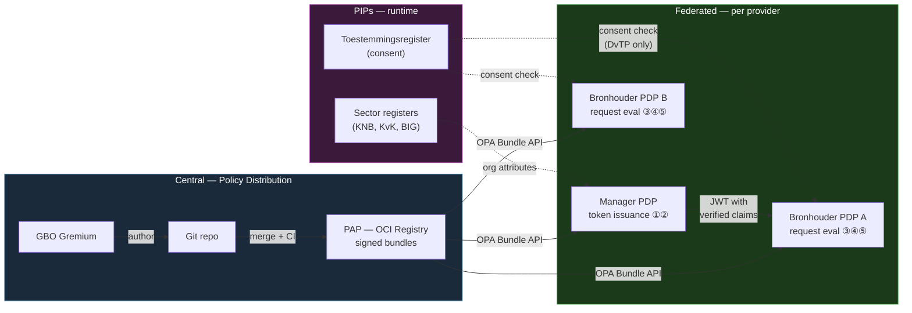

All authorization evidence -- consent records (DvTP), legal basis (OOTS, domestic law-based), wallet presentations (EUDI) -- is translated into AuthZEN Subject/Action/Resource/Context evaluations at the PEP, then evaluated by OPA/Rego policies:

| Trajectory                   | Authorization input                            | Access basis path                     | AuthZEN translation                                                                              |
| ---------------------------- | ---------------------------------------------- | ------------------------------------- | ------------------------------------------------------------------------------------------------ |
| DvTP                         | Citizen consent in register                    | Consent → PIP query                   | Subject=provider org, Resource=consent_id+scope, Context=consent record from PIP                 |
| SDG-OOTS                     | Legal basis (SDG Regulation)                   | Legal basis → policy bundle           | Subject=requesting MS, Resource=evidence type, Context=OOTS request metadata                     |
| Domestic legal basis         | Law mandates access (e.g., Participatiewet)    | Legal basis → policy bundle           | Subject=requesting org, Resource=register+BSN, Context=legal_basis claim                         |
| EDI-wallet (PubEAA issuance) | EUDI wallet PID via OpenID4VCI                 | Self-request (citizen = data subject) | Subject=citizen (via PID), Resource=attestation type, Context=PubEAA Provider trust status       |
| Authentic Source (Art. 45e)  | OAuth token (citizen-authorized) + QTSP status | Citizen-authorized → OAuth            | Subject=QTSP (on Trusted List), Resource=attribute type, Context=citizen authorization via I4/I5 |

One PDP, one policy language, one enforcement point. Multiple trajectories, multiple policy sets — no central authorization server needed.

For the full protocol-level analysis including JWT anatomy, Rego examples, and sequence diagrams for each system, see [Authorization Models Analysis](authorization-models-analysis.md).

### 6. FSC-Primary Connectivity

**Decision**: FSC handles all domestic connectivity. Cross-border (OOTS) traffic arrives via an AS4 bridge that translates to FSC at the edge. There is no need for additional domestic transport protocols -- FSC is the single domestic connectivity stack.

Bronhouders implement one connectivity stack (FSC Inway). The GBO edge layer handles OOTS cross-border translation.

### 7. AS4 Bridge for SDG-OOTS (EU Mandate)

**Decision**: A Domibus Access Point handles SDG-OOTS cross-border evidence exchange. This is an EU regulatory requirement (Single Digital Gateway Regulation), not a choice.

GBO builds this bridge because it must. The bridge translates OOTS AS4 requests into FSC/GraphQL requests toward bronhouders. This is the only scenario where AS4 is needed -- all domestic traffic uses FSC directly.

---

## Component Architecture

### GraphQL Schema Registry + Scope-Driven Field Authorization

Each bronhouder publishes a GraphQL schema describing their data. The **dienstencatalogus** defines which fields are allowed per scope — not as static query templates, but as field allowlists that the PDP evaluates against the parsed query AST at runtime. This follows the approach proven by nID/iWlz, extended with field-level scope enforcement for DvTP's data minimization requirements.

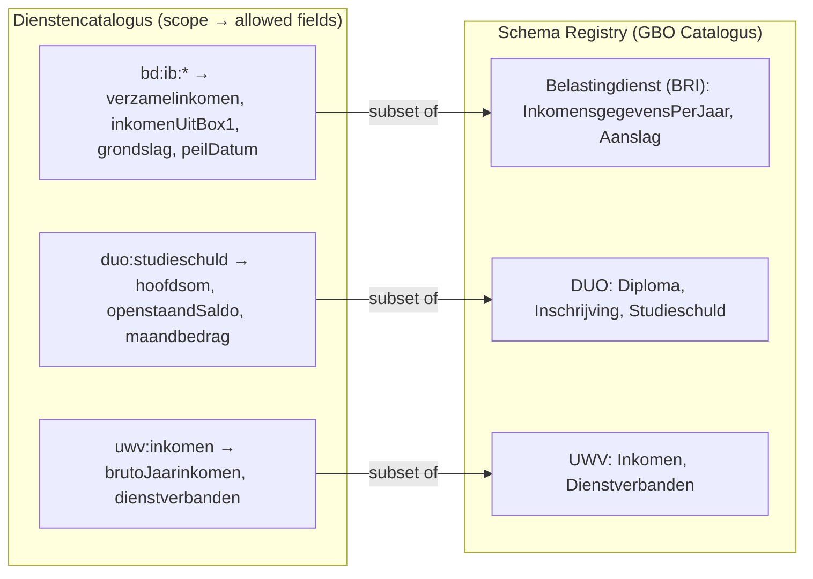

The PDP uses OPA's built-in `graphql.parse_query()` to parse the incoming query into an AST, then enforces two checks:

1. **Scope check (field axis)**: every field in the query's selection set must appear in the allowed field set for the granted scopes in the dienstencatalogus
2. **Constraint check (record axis)**: mandatory `where`-clause arguments must be present and their values must match the caller's identity claims (consent_id for DvTP, OIN + legal_basis for Gov-to-Gov)

**Example: Belastingdienst BRI schema (subset of [full schema](../schemas/belastingdienst-bri-schema.graphql))**

```graphql
type InkomensgegevensPerJaar {
  belastingjaar: Int!
  verzamelinkomen: Int
  inkomenUitBox1: Int
  inkomenUitBox2: Int
  inkomenUitBox3: Int
  grondslag: CodeOmschrijving # e.g. "Definitieve aanslag IB"
  status: CodeOmschrijving # e.g. "Definitief vastgesteld"
  peilDatum: Date
}

type Aanslag {
  belastingjaar: Int!
  soort: SoortAanslag! # VOORLOPIG | DEFINITIEF
  dagtekening: Date!
  verzamelinkomen: Int
  verschuldigdeBelasting: Int
  teBetalen: Int # positief = betalen, negatief = terug
  status: AanslagStatus!
}

input InkomensgegevensInput {
  burgerservicenummer: BSN!
  belastingjaren: [Int!]
  # Data minimization via GraphQL selection set — PDP validates fields against dienstencatalogus
}

type Query {
  inkomensgegevens(input: InkomensgegevensInput!): [InkomensgegevensPerJaar!]!
  aanslagen(input: AanslagenInput!): [Aanslag!]!
  inkomensverklaring(
    input: InkomensverklaringInput!
  ): InkomensverklaringResponse!
}
```

Note: this is the **bronhouder-internal** schema — it uses `burgerservicenummer: BSN!` directly. For DvTP queries, the dienstverlener never sees BSN. The PEP sits in front and translates: the consumer sends a query with `consent_id`, the PEP resolves `consent_id → PI → BSNk Transform → EI → BSN`, then forwards the query to the bronhouder's internal API with the BSN substituted. Debt data (hypotheekschuld, studieschuld) is **not** in the BRI — it comes from other bronhouders (DUO, BKR).

**Example: DvTP query for "aankoop-woning" consent — Belastingdienst leg**

The dienstverlener sends a query with `consentId` as subject. The PEP intercepts, resolves consent_id → BSN via BSNk PP, and forwards to the bronhouder's internal API. Here is the **consumer-facing** query:

```graphql
# Dienstverlener sends this via FSC — consentId is the subject, no BSN
# The selection set IS the data minimization — PDP checks fields against catalog
query AankoopWoningInkomen($consentId: UUID!, $jaren: [Int!]!) {
  inkomensgegevens(input: { consentId: $consentId, belastingjaren: $jaren }) {
    belastingjaar
    verzamelinkomen
    inkomenUitBox1
    grondslag {
      code
      omschrijving
    }
    # inkomenUitBox2 — not in scope bd:ib:*, PDP would reject
    # inkomenUitBox3 — not in scope bd:ib:*, PDP would reject
  }
}
```

The PEP translates this to the bronhouder-internal query (substituting BSN for consentId):

```graphql
# Bronhouder-internal — PEP has resolved consentId → BSN via BSNk PP
query {
  inkomensgegevens(
    input: { burgerservicenummer: "123456789", belastingjaren: [2025, 2024] }
  ) {
    belastingjaar
    verzamelinkomen
    inkomenUitBox1
    grondslag {
      code
      omschrijving
    }
  }
}
```

The PDP validates the consumer-facing query by:

1. **Parsing** the query into an AST via `graphql.parse_query()`
2. **Scope check**: the consent record includes `bd:ib:2025` → dienstencatalogus maps this to allowed fields `{verzamelinkomen, inkomenUitBox1, grondslag, peilDatum}` → all requested fields are in this set → pass
3. **Constraint check**: `consentId` argument is present and matches a valid consent_id with `withdrawn == false` and `valid_until` in the future → pass

The dienstverlener sends separate queries to each bronhouder in the consent (one to Belastingdienst for income, one to DUO for studieschuld, one to UWV for employment income, etc.). Each bronhouder's PDP independently validates its leg against the shared consent record and its own catalog entry.

The same bronhouder schema serves all trajectories. The dienstencatalogus defines different allowed field sets per scope:

| Scope                | Trajectory | Allowed fields (Belastingdienst BRI)                  |
| -------------------- | ---------- | ----------------------------------------------------- |
| `bd:ib:*`            | DvTP       | verzamelinkomen, inkomenUitBox1, grondslag, peilDatum |
| `income-evidence-eu` | SDG-OOTS   | Maps to OOTS-EDM income evidence type fields          |
| `income-attestation` | EUDI       | Fields for PuB-EAA income attestation credential      |

### PEP/PDP/PIP Authorization Chain

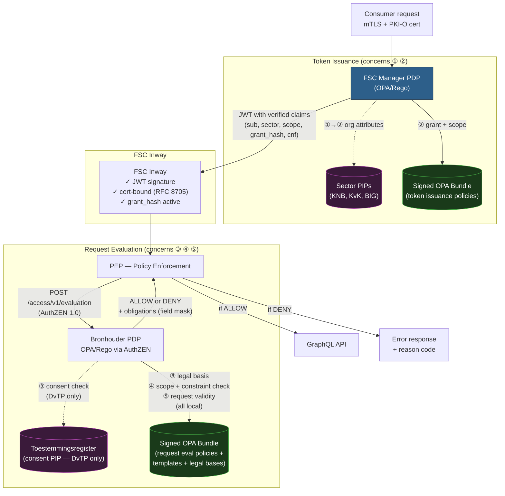

**The core GBO authorization policy (Rego pseudocode)**:

This follows the two-axis model: scopes (field-level) + constraints (record-level), using OPA's built-in `graphql.parse_query()` for AST inspection — the same approach proven in production by nID/iWlz.

```rego
package gbo.authz

import future.keywords.in
import future.keywords.if

default allow := false

# Parse the incoming GraphQL query into an AST (OPA built-in, same as nID/iWlz)
query_ast := graphql.parse_query(input.request.query)

# Main policy: all five concerns must pass
# Concerns ① and ② are pre-verified by the FSC Inway (JWT + cert-binding)
# The PDP evaluates concerns ③, ④, and ⑤
allow if {
    valid_org_permission       # Concern ② (double-check grant_hash in active_grants)
    valid_access_basis         # Concern ③ (consent OR legal basis)
    valid_data_scope           # Concern ④ (scope: allowed fields from dienstencatalogus)
    valid_constraints          # Concern ④b (constraint: mandatory where-clause binding)
    valid_request              # Concern ⑤ (well-formed, within rate limits)
}

# ② Org permission: FSC grant hash matches an active grant for this scope
valid_org_permission if {
    grant := data.active_grants[input.subject.fsc_grant]
    input.context.scope in grant.allowed_scopes
}

# ③ Access basis: either citizen consent or legal basis must be satisfied
valid_access_basis if { valid_citizen_consent }
valid_access_basis if { valid_legal_basis }

# ③a Consent path (DvTP): query toestemmingsregister PIP per-request
# Consent record spans multiple bronhouders; PDP checks the scope entry for THIS bronhouder
valid_citizen_consent if {
    input.pip.consent.exists == true
    input.pip.consent.withdrawn == false
    time.now_ns() < time.parse_rfc3339_ns(input.pip.consent.valid_until)
    input.context.scope in input.pip.consent.granted_scopes          # scope entry for this bronhouder
    input.context.scope in data.dienstencatalogus[input.action.use_case].allowed_scopes  # catalog ceiling
}

# ③b Legal basis path: no PIP call — evaluated from signed policy bundle
valid_legal_basis if {
    basis := data.legal_basis_registry[input.context.legal_basis]
    basis.consent_exempt == true
    input.context.scope in basis.allowed_scopes
}

# ④ Scope axis: every field in the query AST must be in the allowed field set
#    The dienstencatalogus maps each scope to an allowed field set per bronhouder
valid_data_scope if {
    allowed := data.dienstencatalogus[input.context.scope].allowed_fields
    operation := query_ast.Operations[0]
    every selection in operation.SelectionSet {
        every field in selection.SelectionSet {
            field.Name in allowed
        }
    }
}

# ④b Constraint axis: mandatory input arguments must be present and identity-bound
#    Like nID/iWlz: inspect AST arguments, not just field names
valid_constraints if {
    operation := query_ast.Operations[0]
    # consentId must appear as an input argument (DvTP)
    some selection in operation.SelectionSet
    some arg in selection.Arguments
    arg.Name == "input"
    some field in arg.Value.Children
    field.Name == "consentId"
}

# ⑤ Request validity: rate limit, format, timestamp
valid_request if {
    time.now_ns() - time.parse_rfc3339_ns(input.context.timestamp) < 300000000000
    data.rate_limits[input.subject.id].requests_last_hour < 1000
}

# NOTE: BSN resolution (BSNk Transform) happens AFTER this decision, inside the PEP
```

**How the two axes work together** — the dienstencatalogus drives both:

| Axis                     | What it checks                                              | Data source                                         | nID/iWlz precedent                                                                                             |
| ------------------------ | ----------------------------------------------------------- | --------------------------------------------------- | -------------------------------------------------------------------------------------------------------------- |
| **Scope** (fields)       | Requested fields ⊆ allowed fields for this scope            | `dienstencatalogus[scope].allowed_fields`           | New for GBO — nID does not restrict fields because all iWlz actors are government/healthcare with broad access |
| **Constraint** (records) | Mandatory where-clause arguments present and identity-bound | AST argument inspection via `graphql.parse_query()` | Direct from nID — `where_required()` pattern, proven in production                                             |

The scope axis is necessary because DvTP serves private-sector consumers who should only see the specific fields covered by the citizen's consent. The constraint axis ensures queries are bound to the correct citizen and organization. Neither alone is sufficient.

### OOTS AS4 Bridge

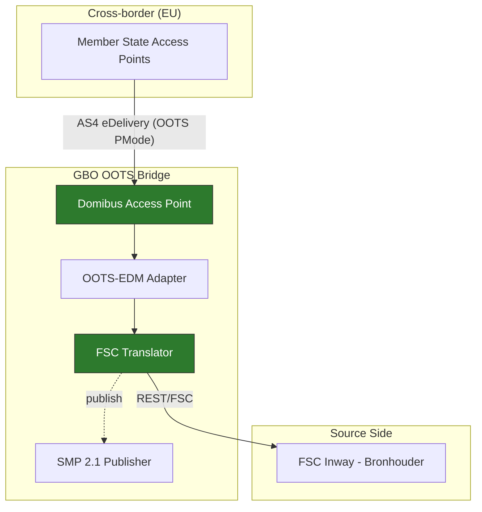

**OOTS bridge specifications**:

| Aspect     | Specification                         |
| ---------- | ------------------------------------- |
| Payload    | OOTS-EDM XML (RegRep 4.0)             |
| Trust      | PKI certificates (national CAs)       |
| Discovery  | SMP 2.1 + NAPTR DNS                   |
| MEP        | One-Way (request + separate response) |
| Validation | Schematron (25 rule sets)             |
| Mandate    | EU Regulation 2018/1724 (SDG)         |

The bridge translates OOTS requests into FSC REST requests toward the bronhouder. The bronhouder sees a standard FSC request regardless of whether it originated from a Dutch dienstverlener (DvTP) or a German Einwohnermeldeamt (OOTS).

### PubEAA Provider

The PubEAA Provider is shared GBO edge infrastructure that issues PuB-EAAs (Public Body Electronic Attestations of Attributes) on behalf of bronhouders. Without it, the Netherlands would rely entirely on commercial QTSPs for issuing attestations based on government sources -- a supply-chain consideration worth addressing.

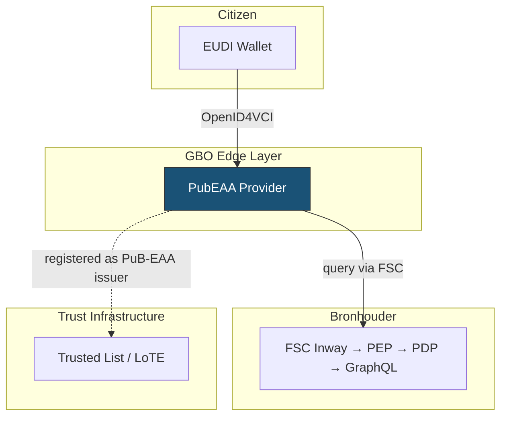

**Key properties**:

| Aspect            | Detail                                                                                            |
| ----------------- | ------------------------------------------------------------------------------------------------- |
| **Protocol**      | OpenID4VCI (same as current EUDI wallet flow)                                                     |
| **Data access**   | Queries bronhouder GraphQL APIs via FSC -- same PEP/PDP chain as all other trajectories           |
| **Signing**       | Qualified electronic seal (PKIoverheid or EUDI Access CA)                                         |
| **Trust**         | Registered on EUDI Trusted Lists as a PuB-EAA Provider                                            |
| **Scope**         | Shared but optional -- bronhouders with capacity can run their own Credential Issuer              |
| **Authorization** | "subject.bsn == resource.bsn" (citizen requests own data) -- same policy as current EUDI issuance |

The PubEAA Provider does not change the bronhouder's responsibilities. It is a shared service that handles the OpenID4VCI protocol, credential formatting (SD-JWT VC / mdoc), and qualified seal signing. The bronhouder only needs to expose a GraphQL API behind an FSC Inway -- the same requirement as for all other trajectories.

### Authentic Source Interface (ETSI TS 119 478)

Article 45e of the amended eIDAS Regulation obliges EU Member States to ensure that QTSPs can verify attributes against authentic sources within the public sector, at the request of the user. ETSI TS 119 478 specifies the interfaces for this. GBO implements the Authentic Source Interface as an edge layer component on top of existing infrastructure.

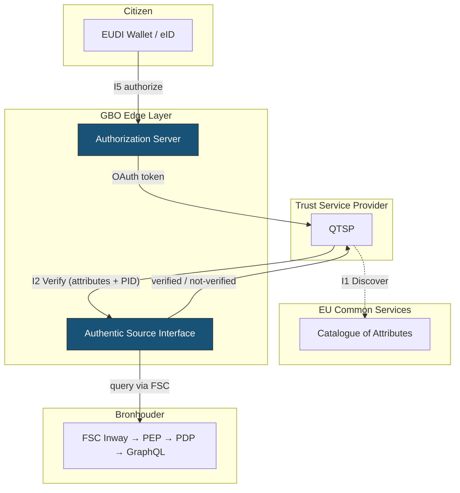

**Interfaces implemented**:

| Interface          | Status                 | Purpose                                                                                  |
| ------------------ | ---------------------- | ---------------------------------------------------------------------------------------- |
| **I1 (Discover)**  | Via EU common services | QTSP discovers available attributes and data service endpoints                           |
| **I2 (Verify)**    | Implemented            | QTSP sends attribute values + user PID → authentic source confirms verified/not-verified |
| **I3 (Retrieve)**  | Not implemented        | Optional per regulation; PubEAA Provider covers direct issuance                          |
| **I4 (Authorize)** | Implemented            | OAuth 2.0 authorization -- citizen authorizes QTSP access                                |
| **I5 (User)**      | Implemented            | Citizen authenticates via EUDI Wallet or eID, authorizes the verification request        |

**How it maps to GBO**: The Authentic Source Interface is a protocol adapter. GBO's bronhouder GraphQL APIs behind FSC Inways are the authentic sources. The ASIP translates I2 (Verify) requests into GraphQL queries via FSC, compares the result with the QTSP-provided attribute values, and returns a verification result. The authorization flow (I4/I5) is analogous to DvTP's consent portal -- different mechanism (OAuth vs consent register), same pattern (citizen authorizes access to their data).

**Technical variant**: HTTP/OAuth (ETSI TS 119 478 clause 6.1) -- aligns with GBO's REST/FSC stack.

---

## Demo Interaction 1: DvTP -- Hypotheekverlener Queries Income Data

**Scenario**: Jan wants a mortgage. His hypotheekverlener (mortgage provider) needs his income data from the Belastingdienst. Jan must give explicit consent.

### Full Sequence

```mermaid
sequenceDiagram
    actor Jan as Jan (Burger)
    participant HV as Hypotheekverlener -(Private Dienstverlener)
    participant PORTAL as Toestemmingsportaal -(Government)
    participant DIGID as DigiD / EUDI Wallet
    participant BSNK as BSNk PP -(Logius)
    participant CREG as Toestemmingsregister -(PIP)
    participant FSC_O as FSC Outway -(HV)
    participant MGR as FSC Manager -(Belastingdienst, Manager PDP)
    participant FSC_I as FSC Inway -(Belastingdienst)
    participant PEP as PEP
    participant PDP as Bronhouder PDP -(OPA/Rego)
    participant GQL as GraphQL API -(Belastingdienst)

    Note over Jan,HV: Phase 1: Consent + Pseudonymization

    Jan->>HV: "Ik wil een hypotheek aanvragen"
    HV->>Jan: Redirect to Toestemmingsportaal -(context: scope=aankoop-woning, -provider=HV, return_url=...)

    Jan->>PORTAL: Arrives at consent portal
    PORTAL->>DIGID: Authenticate citizen
    DIGID->>Jan: DigiD login (or EUDI Wallet PID)
    Jan->>DIGID: Authenticates (BSN verified)
    DIGID->>PORTAL: Identity confirmed (BSN: 123456789)

    PORTAL->>BSNK: BSNk Activate(BSN=123456789)
    BSNK-->>PORTAL: Signed PI + Signed PP
    PORTAL->>BSNK: BSNk Transform(PP, target=HV OIN)
    BSNK-->>PORTAL: Encrypted Pseudonym (EP) for HV

    PORTAL->>Jan: Shows consent screen: -"Hypotheekverlener BV wil de volgende -gegevens opvragen: -- Belastingdienst: inkomensgegevens (2024, 2025) -- DUO: studieschuld -- UWV: inkomen -- BKR: kredietregistratie -Geldig voor 30 dagen."
    Jan->>PORTAL: Geeft toestemming (consent granted)

    PORTAL->>CREG: Write consent record: -consent_id=550e8400..., PI=..., -provider=HV, -scopes=[bd:ib:2025, bd:ib:2024, -duo:studieschuld, uwv:inkomen, -bkr:registratie], -expires=2026-04-11
    Note over CREG: No BSN stored -- only PI. -Single consent, multiple bronhouders.

    PORTAL->>Jan: Redirect back to HV with -consent_token(consent_id, EP, scope, expiry, sig)
    Note over HV: HV decrypts EP with own key -+ closing key = party-specific pseudonym. -HV NEVER sees BSN.

    Note over HV,GQL: Phase 2: Token Issuance (Manager PDP evaluates ① ②)

    HV->>FSC_O: GraphQL query (scope: bd:ib) -variables: consentId=550e8400..., jaren=[2025,2024]

    FSC_O->>MGR: POST /token (mTLS + PKI-O cert) -{ grant_hash: "abc123", -scope: "dvtp:aankoop-woning" }

    Note over MGR: Manager PDP evaluates: -✓ ① PKI-O cert valid (OIN = HV) -✓ ② Grant active, scope allowed -✓ ①→② Org type verified (sector PIP)

    MGR-->>FSC_O: JWT { sub: "OIN:...HV", -scope: "dvtp:aankoop-woning", -grant_hash: "abc123", -cnf: { x5t#S256: "..." } }

    Note over HV,GQL: Phase 3: Data Retrieval (Bronhouder PDP evaluates ③ ④ ⑤)

    FSC_O->>FSC_I: POST /graphql + Bearer JWT -(mTLS + PKI-O cert)
    FSC_I->>FSC_I: ✓ JWT signature valid -✓ cert-bound (RFC 8705) -✓ grant_hash active
    FSC_I->>PEP: Forward request

    PEP->>PDP: AuthZEN eval: -subject={org: HV, grant: "abc123"} -action={scope: aankoop-woning, query: <GraphQL body>} -resource={consent_id: 550e8400...} -context={trajectory: dvtp}

    PDP->>CREG: Consent exists for -consent_id 550e8400... + HV + aankoop-woning?
    CREG-->>PDP: Yes, valid until 2026-04-11

    PDP->>PDP: Scope check: requested fields ⊆ -catalog[bd:ib:2025].allowed_fields? Yes. -Constraint check: consent_id in -where-clause? Yes.

    PDP-->>PEP: ALLOW -(obligations: allowed_fields)

    Note over PEP,BSNK: BSN Resolution (government-internal)
    PEP->>BSNK: BSNk Transform(PI from consent, -target=Belastingdienst OIN)
    BSNK-->>PEP: Encrypted Identity (EI) for Belastingdienst
    PEP->>PEP: Decrypt EI with own key = BSN

    PEP->>GQL: Execute GraphQL query -(BSN substituted internally, -never exposed to dienstverlener)
    Note over GQL: Returns ONLY authorized fields: -verzamelinkomen, inkomenUitBox1, -grondslag, peilDatum

    GQL-->>PEP: Sealed response (qualified electronic seal)
    PEP-->>FSC_I: Response + log to Logboek Dataverwerkingen
    FSC_I-->>FSC_O: mTLS response
    FSC_O-->>HV: Income data (only consented fields, no BSN)

    HV->>Jan: "Uw gegevens zijn opgehaald, -we verwerken uw aanvraag."
```

### What the GraphQL Request Looks Like

```graphql
# Sent by Hypotheekverlener via FSC — Belastingdienst leg only
# PDP validates: selection set fields ⊆ catalog[bd:ib:*] + consentId in input
# Note: consentId is the subject -- NO BSN in the request
query AankoopWoningInkomen($consentId: UUID!, $jaren: [Int!]!) {
  inkomensgegevens(input: { consentId: $consentId, belastingjaren: $jaren }) {
    belastingjaar
    verzamelinkomen
    inkomenUitBox1
    grondslag {
      code
      omschrijving
    }
  }
}
```

**Variables**: `{ "consentId": "550e8400-e29b-41d4-a716-446655440000", "jaren": [2025, 2024] }`

The PEP intercepts this query, resolves `consent_id → PI → BSNk Transform → EI → BSN`, and substitutes the BSN into the bronhouder's internal query. The dienstverlener's query and response contain no BSN at any point.

### What the Policies Evaluate

Two PDPs evaluate in sequence — the Manager PDP at token issuance, the bronhouder PDP per-request:

```
── Manager PDP (at token issuance, concerns ① ②) ──

INPUT:
  client_cert.oin      = "OIN:00000004003214345001" (Hypotheekverlener BV)
  client_cert.chain    = valid (PKI-O Root CA → TSP CA → end cert)
  grant_hash           = "abc123"
  requested_scopes     = ["dvtp:aankoop-woning"]
  pip.sector           = { member: true, sector: "hypotheekverleners" } (from KvK SBI PIP)

POLICY CHECKS:
  ① Is PKI-O cert chain valid?                          -> YES
  ①→② Is OIN in sector "hypotheekverleners"?            -> YES (KvK SBI PIP)
  ② Is grant "abc123" active for this scope?             -> YES
  ② Is "dvtp:aankoop-woning" ⊆ grant.scopes?            -> YES

DECISION: ISSUE JWT
  { sub: "OIN:...HV", scope: "dvtp:aankoop-woning",
    sector: "hypotheekverleners", grant_hash: "abc123",
    cnf: { x5t#S256: "<cert>" } }

── Bronhouder PDP (per-request, concerns ③ ④ ⑤) ──

INPUT (from JWT claims + request):
  subject.org_id       = "OIN:00000004003214345001" (from JWT sub)
  subject.fsc_grant    = "abc123" (from JWT grant_hash)
  action.scope         = "aankoop-woning"
  action.query         = <GraphQL AST (fields: verzamelinkomen, inkomenUitBox1, grondslag)>
  resource.consent_id  = "550e8400-e29b-41d4-a716-446655440000"
  context.trajectory   = "dvtp"

POLICY CHECKS:
  ③ Does consent exist for consent_id+provider?            -> YES (PIP query to register)
  ③ Does consent include scope for this bronhouder?        -> YES (bd:ib:2025 ∈ granted_scopes)
  ③ Is consent still valid (not expired, not withdrawn)?   -> YES (expires 2026-04-11)
  ③ Is scope within dienstencatalogus ceiling?             -> YES (bd:ib:2025 ∈ catalog[aankoop-woning])
  ④ Scope: are all requested fields in catalog[bd:ib:*]?   -> YES (verzamelinkomen, inkomenUitBox1, grondslag ⊆ allowed)
  ④ Constraint: is consentId in input arguments?            -> YES (identity-bound)
  ⑤ Rate limit OK? Format valid?                           -> YES

DECISION: ALLOW (obligations: allowed_fields=[verzamelinkomen, inkomenUitBox1, grondslag, peilDatum])

POST-DECISION (inside PEP, not visible to dienstverlener):
  6. Retrieve PI from consent record
  7. BSNk Transform(PI, bronhouder_oin) → EI
  8. Decrypt EI → BSN (government-internal)
  9. Substitute BSN into bronhouder query
```

Note: steps 6-9 happen **after** the policy decision, inside the PEP. The dienstverlener's request and the policy evaluation never touch BSN. BSN only appears in the government-internal leg between PEP and bronhouder.

### What If Consent Was Revoked?

If Jan revokes his consent via the consent management portal (FR-20), the register record status changes to "revoked." The next time the hypotheekverlener sends a query:

```
POLICY CHECK ③: consent.status == "open"? -> NO (status: "revoked")
DECISION: DENY (reason: "consent_revoked")
```

No token invalidation needed. No notification to the hypotheekverlener needed. The PDP simply denies the next request. This is cleaner than the approach in DvTP's draft v0.1 of checking consent tokens at multiple points.

---

## Demo Interaction 2: EUDI Wallet -- Citizen Stores Income Attestation via PubEAA Provider

**Scenario**: Jan wants his income data in his EUDI wallet so he can present it to anyone -- not just the hypotheekverlener. He retrieves a PuB-EAA (Public Body Electronic Attestation of Attributes) via the shared PubEAA Provider, which queries the Belastingdienst on his behalf. The PuB-EAA is stored in his wallet.

### Issuance -- PubEAA Provider Issues Attestation to Wallet

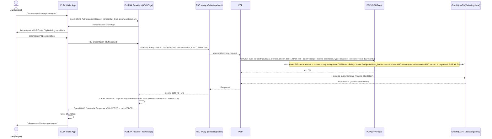

Note: Bronhouders can optionally run their own Credential Issuer instead of using the shared PubEAA Provider. The data flow remains the same -- only the issuer endpoint changes.

---

## Demo Interaction 3: Gov-to-Gov -- Gemeente Queries RvIG

**Scenario**: A gemeente needs to verify a citizen's address data from RvIG (Basisregistratie Personen). This is a government-to-government exchange -- no consent needed, no pseudonymization, just legal-basis authorization over FSC.

### Full Sequence

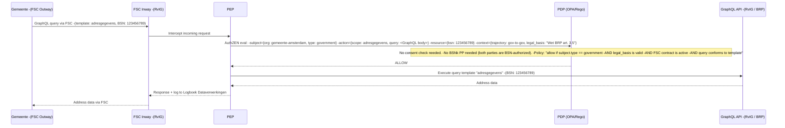

This is the simplest GBO flow -- it shows the pure backbone without any consent, pseudonymization, or protocol translation. All other trajectories build on this foundation by adding edge-layer components.

### What the Policy Evaluates

```
INPUT:
  subject.org_id     = "OIN:00000001003214345001" (Gemeente Amsterdam)
  subject.type       = "government"
  subject.fsc_contract = { status: "active" }
  action.scope       = "adresgegevens"
  action.query       = <GraphQL query body>
  resource.bsn       = "123456789"
  context.trajectory = "gov-to-gov"
  context.legal_basis = "Wet BRP art. 3.5"

POLICY CHECKS:
  1. Is subject a government organization?                    -> YES
  2. Is FSC contract active?                                  -> YES
  3. Is legal basis valid for this data type?                  -> YES (Wet BRP art. 3.5)
  4. Does query structure conform to template "adresgegevens"? -> YES

DECISION: ALLOW
```

No consent register lookup, no BSNk PP resolution. Government parties are BSN-authorized and access is governed by legal basis, enforced by the same PEP/PDP chain.

---

## Demo Interaction 4: Citizen Presents Credential to Relying Party

**Scenario**: Jan already has his income PuB-EAA in his wallet (from Demo 2). He visits a hypotheekverlener and presents the attestation directly -- no real-time query to the Belastingdienst needed.

### Full Sequence

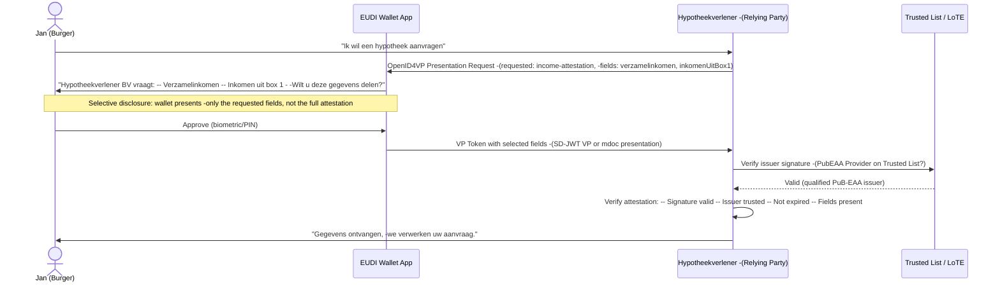

The Relying Party verifies the PuB-EAA independently -- no connection to GBO or the bronhouder is needed at presentation time. Trust is established via the EUDI Trusted List: the PubEAA Provider is registered as a qualified PuB-EAA issuer.

---

## Demo Interaction 5: QTSP Verifies Attributes via Authentic Source Interface

**Scenario**: A QTSP wants to issue a QEAA (Qualified Electronic Attestation of Attributes) for Jan's income data. Before issuing, the QTSP must verify the attributes against the authentic source (Belastingdienst), as mandated by Article 45e. Jan authorizes this verification.

### Full Sequence

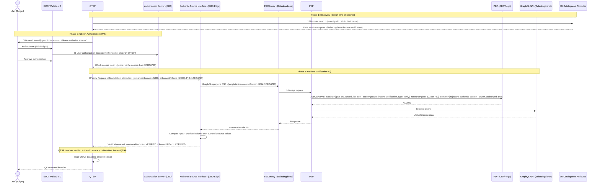

The Authentic Source Interface acts as a protocol adapter: it translates ETSI TS 119 478 I2 (Verify) requests into GraphQL queries via FSC, compares the QTSP-provided attribute values against the register, and returns a verification result. The bronhouder sees a standard FSC request -- it does not know whether the request came from a DvTP dienstverlener, an OOTS bridge, a PubEAA Provider, or the Authentic Source Interface.

---

### Key Differences Across Trajectories

| Aspect                  | DvTP (Demo 1)            | PubEAA Issuance (Demo 2)          | Gov-to-Gov (Demo 3)                | RP Presentation (Demo 4)        | Art. 45e Verification (Demo 5)            |
| ----------------------- | ------------------------ | --------------------------------- | ---------------------------------- | ------------------------------- | ----------------------------------------- |
| **Who initiates**       | Private dienstverlener   | Citizen via wallet                | Government party                   | Citizen via wallet              | QTSP (citizen-authorized)                 |
| **Authorization**       | Consent register (PIP)   | Self-request (bsn == bsn)         | Legal basis (wettelijke grondslag) | N/A (citizen presents directly) | OAuth token (citizen-authorized)          |
| **BSN handling**        | BSNk PP pseudonymization | BSN via PID (government-internal) | BSN directly (both gov parties)    | No BSN (credential-based)       | BSN via PID (citizen-authorized)          |
| **Bronhouder involved** | Every request            | At issuance only                  | Every request                      | Not at all                      | Every verification request                |
| **Data freshness**      | Real-time                | Issuance moment                   | Real-time                          | Issuance moment (may be stale)  | Real-time verification                    |
| **Edge component**      | Consent portal + BSNk PP | PubEAA Provider                   | None (direct FSC)                  | None (wallet-to-RP)             | Authentic Source Interface + AuthZ Server |
| **Consumer sees BSN?**  | Never                    | N/A (citizen's own data)          | Yes (gov-authorized)               | No                              | No (PID only)                             |

**Same backend**: All server-side trajectories (Demo 1, 2, 3, 5) use the same bronhouder GraphQL API and the same PEP/PDP infrastructure. The difference is in the authorization policy and the protocol at the consumer edge. Demo 4 (RP presentation) is purely wallet-to-RP and does not touch GBO infrastructure at all.

---

## SDG-OOTS Cross-Border Bridge

### Why OOTS Requires an AS4 Bridge

The Single Digital Gateway Regulation (EU 2018/1724) mandates cross-border evidence exchange via the Once-Only Technical System (OOTS). This is a legal obligation, not an architectural choice. OOTS uses eDelivery AS4 transport with Domibus Access Points, four-corner routing, and SMP 2.1 discovery.

GBO must build an AS4 bridge to serve cross-border requests. This bridge translates OOTS AS4 requests into FSC/GraphQL requests toward bronhouders, and returns evidence in OOTS-EDM format.

### OOTS Bridge Architecture

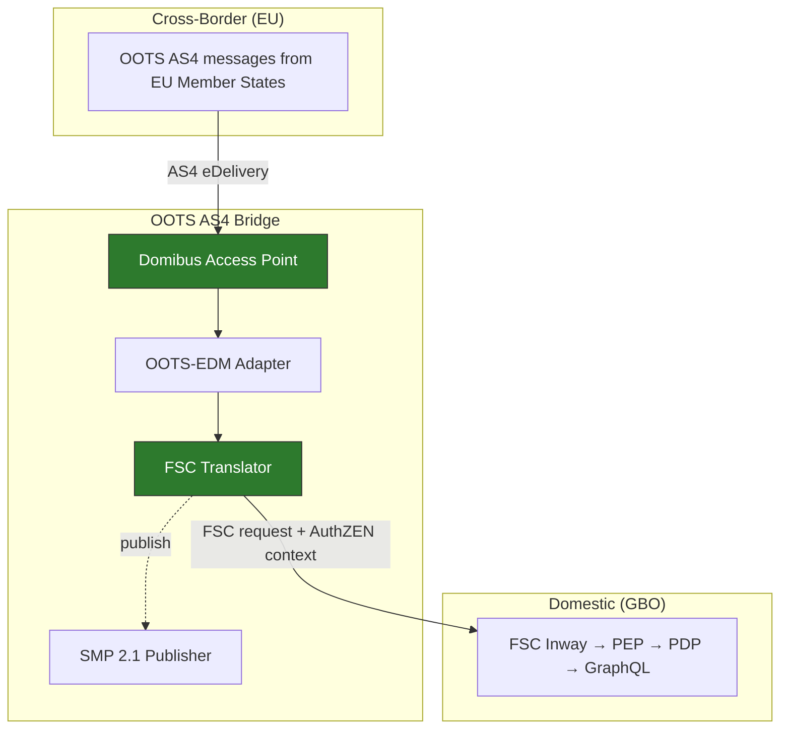

From the bronhouder's perspective, cross-border requests look identical to domestic DvTP requests -- an FSC request with an AuthZEN-evaluable authorization context. Whether it originated from a Dutch hypotheekverlener (DvTP/FSC) or a German Einwohnermeldeamt (OOTS/AS4) is invisible to the source. The bridge handles all translation.

Domestic dienstverleners use FSC directly. AS4 is reserved for cross-border traffic via the OOTS bridge.

---

## Gap Analysis & Recommendations

### Gap 1: Authorization Policy Lifecycle (Critical)

**Gap**: The five orthogonal authorization concerns are now well-defined (see [Authorization Models Analysis](authorization-models-analysis.md)), but the end-to-end policy lifecycle — from authoring to signing to distribution to runtime evaluation — requires tooling and governance processes that do not yet exist.

**Recommendation**:

1. Start with iWlz's OPA/Rego as the PDP baseline — it works in production
2. Implement the policy distribution pipeline: Git repo → CI/CD (cosign signing) → OCI registry → OPA Bundle API pull at each bronhouder
3. Define the AuthZEN S/A/R/C vocabulary for GBO: Subject=OIN from PKI-O cert, Action=GraphQL operation+fields, Resource=register+data_subject, Context=scope+legal_basis+timestamp
4. Implement the dual access basis path in Rego: consent check (PIP query) for DvTP, legal basis check (from bundle) for law-mandated access
5. Publish Rego policy templates for each trajectory so bronhouders don't write policies from scratch
6. Define FSC Grant schema extensions: scope annotations (Level 2) and policy bundle references (Level 3) — propose via Logius/VNG standards process
7. No central authorization server — the FSC Manager is the token issuer. Upgrade it to **policy-driven**: own OPA/Rego PDP loaded from the same PAP, with PIP access to sector registers (KvK SBI, KNB, BIG, AFM) for organizational attribute verification at token issuance time
8. Define `SectorConnectionGrant` type in FSC Grant schema — enables sector-level grants ("all notarissen may access kadaster data") instead of per-organization contracts. Document JWT claim set including: sub, scope, fsc_grant_hash, cnf, policy_version, **sector**, **sector_verified_by**

### Gap 2: Identity Convergence + BSN Pseudonymization (High)

**Gap**: PKIoverheid and EUDI introduce different trust models (Access CA + Trusted Lists). BSN pseudonymization for private parties is needed -- BSNk PP provides this but is not yet integrated into the GBO architecture.

**Recommendation**:

1. Push for PKIoverheid as the Dutch EUDI Access Certificate Authority -- this is the highest-leverage convergence decision
2. Mandate PKIoverheid for all bronhouders and dienstverleners (they already have certificates for FSC)
3. Map organizational identifiers: OIN, KvK-nummer, ETSI NTRNL-xxx, and EUDI identifiers to a common anchor (KvK-nummer)
4. Integrate BSNk PP as the pseudonymization layer: onboard Toestemmingsportaal as BSNk participant (AD/MR role), onboard PEP as BSN-authorized component for PI→EI resolution, onboard private dienstverleners for EP decryption key distribution
5. Clarify relationship between BSNk PP pseudonyms (server-to-server, per-OIN) and EUDI wallet pseudonyms (user-controlled, per-rpId) -- these are complementary, not competing systems
6. Recognize QTSP trust chains via EUDI Trusted Lists -- accept QTSP-signed attestations and seals as trust evidence in PDP policies via the eIDAS trust infrastructure

### Gap 3: Semantic Mapping (Medium)

**Gap**: No canonical data models for the "generieke gegevenssets" that span trajectories. National data formats don't map to OOTS-EDM evidence types or EUDI attestation schemas.

**Recommendation**:

1. Define GraphQL schemas per bronhouder as the canonical model (single source of truth)
2. Generate serializations from the schema: JSON for FSC, OOTS-EDM XML for cross-border, SD-JWT VC / mdoc for EUDI wallet
3. Prioritize the data sets from DvTP FR-05 through FR-25 as the first canonical models
4. For OOTS: map to the 9 evidence types in the OOTS Semantic Repository
5. For EUDI: align with PuB-EAA attestation schemas from the Commission Implementing Regulations

### Gap 4: GraphQL Standardization within FDS (Medium)

**Gap**: FDS mandates REST API Design Rules. GraphQL is not yet a recognized datadienst type, though IMX already supports it and Lock-Unlock identifies the REST limitation for fine-grained access.

**Recommendation**:

1. Position GraphQL as running OVER FSC, not replacing it. FSC proxies HTTP; it doesn't care about payload format
2. Propose GraphQL as an additional datadienst type alongside REST via the FDS standaardenlandkaart process
3. Use iWlz as the precedent: a Dutch government system running GraphQL + OPA/PBAC in production for sensitive data
4. Align with FTV's AuthZEN: GraphQL query introspection maps cleanly to Subject/Action/Resource/Context

### Gap 5: Traceability Correlation (Medium)

**Gap**: No cross-framework log correlation. FSC Transaction Logs, OOTS evidence records, wallet transaction logs, and DvTP audit logs exist in separate systems.

**Recommendation**:

1. Mandate Logboek Dataverwerkingen (LDV) for all GBO interactions
2. Use OpenTelemetry trace IDs as the correlation key across systems
3. Accept that EUDI wallet-local logs are private (cannot be correlated server-side)
4. Implement iWlz's TraceID/SpanID pattern for distributed tracing across GBO components

### Gap 6: Bronhouder Onboarding Toolkit (Medium)

**Gap**: Even with the simplified architecture (one GraphQL endpoint + FSC Inway + PEP), onboarding bronhouders is complex. Smaller bronhouders (gemeenten) may lack capacity.

**Recommendation**:

1. Provide pre-configured GBO containers: FSC Inway + **Manager with PDP** + PEP + bronhouder OPA/Rego PDP as a deployable package. Both PDPs load from the same PAP (OCI registry)
2. Publish Rego policy templates per trajectory (token issuance policies for Manager PDP, request evaluation policies for bronhouder PDP)
3. Provide sector PIP integration configuration: pre-built connectors for KvK SBI, KNB, BIG, AFM registers so the Manager PDP can verify organizational attributes out of the box
4. Offer a GBO translation layer (shared service) for small bronhouders who cannot run their own GraphQL endpoint
5. Define a reference onboarding process: PKIoverheid cert → FSC registration → sector PIP registration → DCAT self-description → policy configuration → trajectory activation

### Gap 7: PubEAA Provider (Critical)

**Gap**: No government-operated PuB-EAA Provider exists for issuing electronic attestations of attributes from government sources. Without one, the Netherlands relies entirely on commercial QTSPs for government-sourced attestations -- a supply-chain consideration worth addressing.

**Recommendation**:

1. Build the PubEAA Provider as shared GBO edge infrastructure, issuing PuB-EAAs on behalf of bronhouders via OpenID4VCI
2. Register on EUDI Trusted Lists as a qualified PuB-EAA issuer
3. Define issuance policies per bronhouder and attestation type (Rego policy templates)
4. Sign PuB-EAAs with qualified electronic seal (PKIoverheid or EUDI Access CA)
5. Offer as default path -- bronhouders with capacity can optionally run their own Credential Issuer

### Gap 8: Authentic Source Interface -- Article 45e (Critical)

**Gap**: Article 45e of the amended eIDAS Regulation mandates that EU Member States ensure QTSPs can verify attributes against authentic sources within the public sector, at the request of the user -- by 24 December 2026. ETSI TS 119 478 specifies the interfaces. No such interface exists yet for Dutch government registers. Without it, QTSPs cannot verify government-sourced attributes, blocking the entire QEAA ecosystem.

**Recommendation**:

1. Build the Authentic Source Interface as a GBO edge service implementing ETSI TS 119 478 (HTTP/OAuth variant, clause 6.1)
2. Implement I2 (Verify) + I4 (Authorize) on top of existing FSC/GraphQL infrastructure -- the ASIP translates verification requests into GraphQL queries via FSC
3. I3 (Retrieve) is optional per regulation and not implemented -- the PubEAA Provider covers direct issuance
4. Register data services in the EU catalogue of attributes via I1 (Discover), reusing OOTS common services infrastructure
5. Build the Authorization Server (I4) using OAuth 2.0 -- citizen authorizes QTSP access via EUDI Wallet or eID (I5)
6. Define PDP policies for QTSP verification requests: requester must be on Trusted List, citizen must have authorized, requested attributes must be in scope
